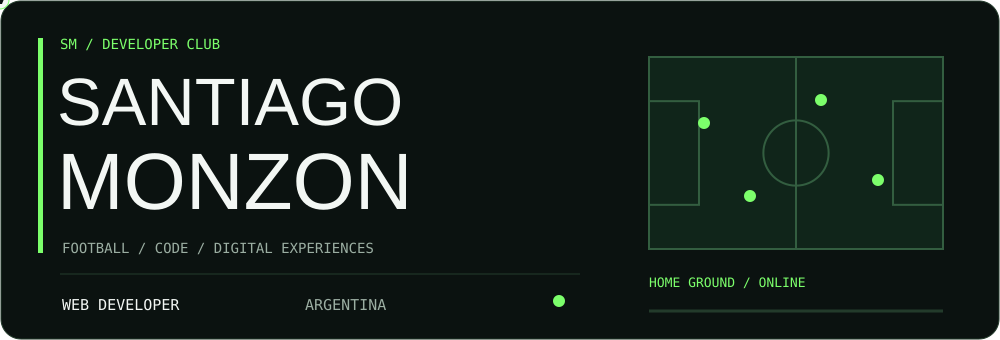
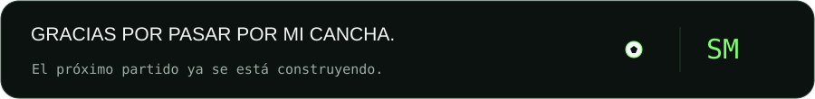

<h1>⚽ Santiago Monzon</h1>

<b>WEB DEVELOPER · FOOTBALL × CODE</b>

  
  

[Player profile](#-player-profile) · [Starting XI](#-starting-xi) · [Projects](#-matchday-projects) · [Season stats](#-season-stats) · [Contacto](#-transfer-window)

## ⚽ PLAYER PROFILE

Soy **Santiago**, desarrollador web de **San Antonio de Areco, Argentina**. Me gusta construir interfaces que se entiendan rápido, tengan personalidad y den ganas de volver.

El fútbol pone la pasión; la programación, las herramientas. **FutAPA** es donde quiero juntar las dos.

| Ficha del jugador | En cancha |
| :--- | :--- |
| 💻 **Posición** | Desarrollo web e interfaces |
| 🏟️ **Localía** | San Antonio de Areco · Buenos Aires · Argentina |
| ⚽ **Proyecto principal** | FutAPA · en desarrollo |
| 🎮 **Intereses** | Fútbol, videojuegos y experiencias interactivas |
| 🎯 **Objetivo** | Convertir ideas en productos claros, útiles y con identidad |

## 🏆 MATCHDAY PROJECTS

Web, apps y herramientas que conectan código, diseño y fútbol.

### ⚽ FutAPA · Web

**Proyecto principal · En desarrollo**

Prototipo de fútbol con colección de cartas, apertura de sobres, recompensas diarias y progreso guardado localmente.

**Next.js**

---

### 📱 FutAPA · Flutter

Versión de FutAPA para explorar la experiencia como aplicación.

**Flutter · Dart**

---

### 🏟️ APA-WEB

Plataforma web para ligas, equipos, torneos y partidos.

**Next.js · React · TypeScript · Supabase**

---

### 🤖 ApaBotMix

Bot de Discord para organizar partidas MIX de Pro Soccer Online: colas por roles, elección de capitanes, draft y rankings.

**.NET · DSharpPlus · SQLite**

---

### 🍣 SushiSoul Web

Landing gastronómica para presentar la marca, la carta y los locales, con acceso a la app de pedidos.

**Next.js · React · TypeScript · Motion**

---

### 💻 Portfolio

Mi presentación como desarrollador web, con interfaces responsive y animaciones.

**HTML5 · CSS3 · JavaScript · GSAP**

[Ver repositorio →](https://github.com/MonzonSantiago/portfolio)

---

### 🧩 Portfolio Monchon

Otra versión de mi presentación profesional, enfocada en servicios de desarrollo web.

**HTML · CSS · JavaScript**

---

### ⚽ Fútbol Monchon

Espacio reservado para un próximo proyecto de fútbol.

**En preparación**

## ⚽ STARTING XI

Estructura, diseño e interacción.

   &nbsp;
   &nbsp;
   &nbsp;
  

<b>HTML5 · CSS3 · JavaScript · GSAP</b>

Stack utilizado en mi <a href="https://github.com/MonzonSantiago/portfolio">portfolio público</a>.

## 🤝 THE SQUAD

   &nbsp;
  

<b>Git · GitHub · Diseño responsive</b>

**Control de versiones, adaptación a distintos tamaños de pantalla y atención al detalle.** La base para que cada proyecto llegue bien al partido.

## 🏋️ TRAINING GROUND

| Entrenamiento | Foco actual |
| :--- | :--- |
| ⚽ **FutAPA** | Dar forma a una experiencia digital centrada en fútbol |
| 🎨 **Interfaces** | Jerarquía visual, navegación clara y personalidad |
| ✨ **Movimiento** | Animaciones que acompañen la interacción |
| 🧩 **Desarrollo** | Construir, probar y mejorar en cada iteración |

> **Cada sesión suma. Cada versión enseña.**

## 📊 SEASON STATS

<b>El marcador se construye jugando.</b> Actividad registrada por GitHub. Las tarjetas se actualizan desde sus servicios de origen.

  

  

<a href="https://github.com/MonzonSantiago?tab=repositories">Repositorios públicos</a> · <a href="https://github.com/MonzonSantiago">Ver actividad en GitHub</a>

## 🧠 TACTICAL PHILOSOPHY

| Principio | Cómo lo llevo al código |
| :--- | :--- |
| 🎯 **Jugar simple** | Interfaces claras y decisiones con propósito |
| 🤝 **Pensar en el equipo** | Código legible y fácil de continuar |
| ✨ **Moverse con intención** | Animaciones que orienten y den respuesta |
| 🔁 **Leer el partido** | Probar, escuchar y ajustar la siguiente versión |

<b>IDEA → DISEÑO → CÓDIGO → PRUEBA → MEJORA</b>

> Una buena jugada se entrena. Un buen producto también.

## 📬 TRANSFER WINDOW

¿Tenés una idea para una web, una experiencia interactiva o un proyecto relacionado con fútbol? **Armemos equipo.**

  
  
  

🎨 Detrás de la cancha

Gráficos y animaciones SVG propios, guardados en este repositorio. Logos: [Devicon](https://github.com/devicons/devicon) y [Simple Icons](https://github.com/simple-icons/simple-icons). Los logos representan las tecnologías utilizadas en el portfolio público; los nombres de las secciones son parte del concepto futbolero.

Recursos del marcador: [Shields.io](https://shields.io), [Readme Typing SVG](https://github.com/DenverCoder1/readme-typing-svg), [GitHub Stats Extended](https://github.com/stats-organization/github-stats-extended), [GitHub Streak Stats](https://github.com/DenverCoder1/github-readme-streak-stats).

